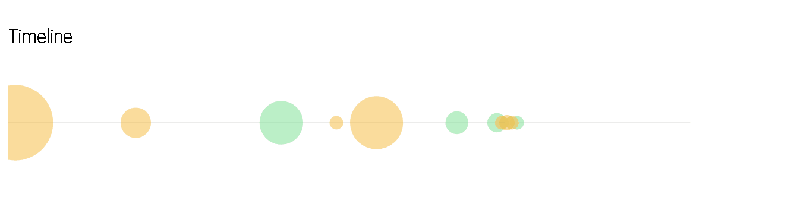

# Interactive timeline
☄ Interactive timeline built with D3 with pure CSS animations  

**any suggestion is welcome :)**  

## Features  
- Size of the circle depends on the duration of the experience  
- Color of the circle depends on the category (work or education here)  
- All the animations are made with pure CSS (yaaaaas!)  
- Data come from a JSON file you can easily edit if you want to try with your own xp  

## Dependencies  
- D3.js (OFC ;)  
- Moment  
- Material icons (design purpose only)  
- Google font (design purpose only)  
